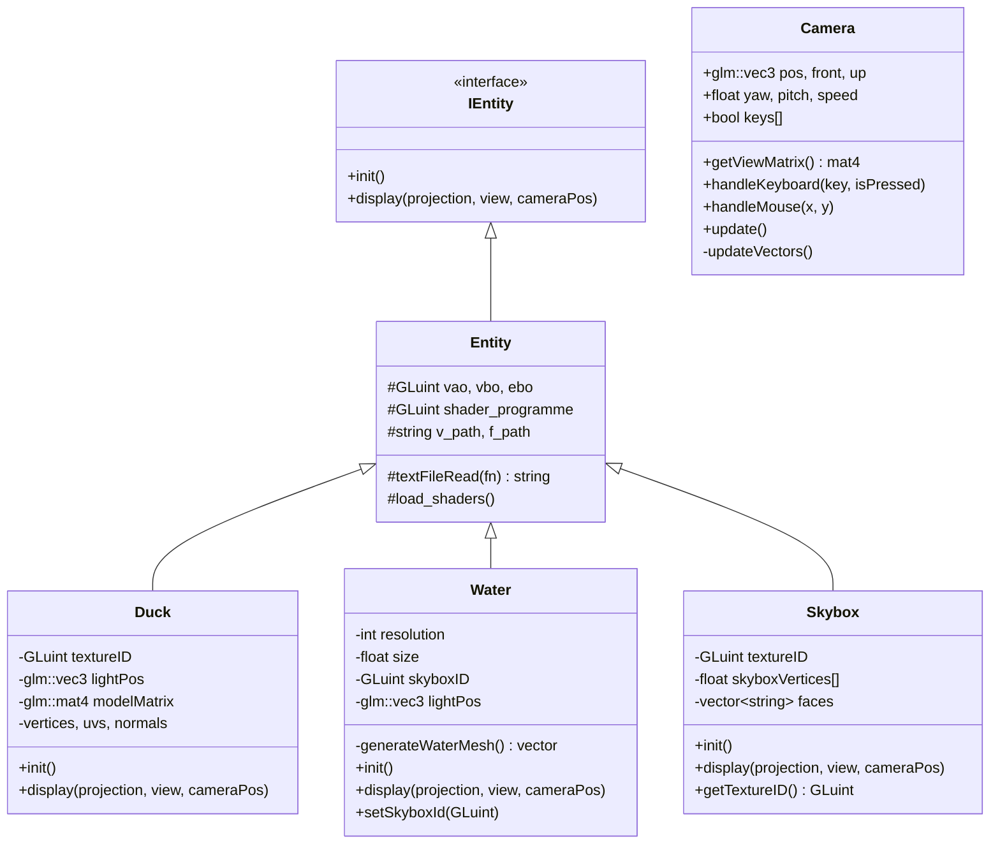
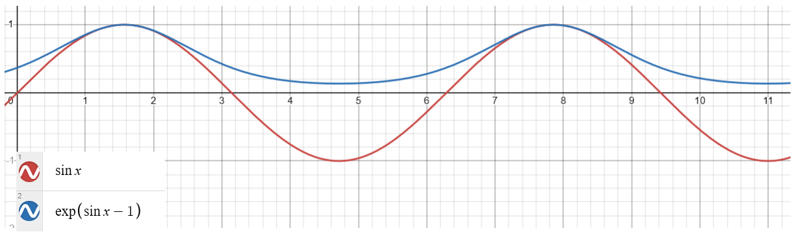
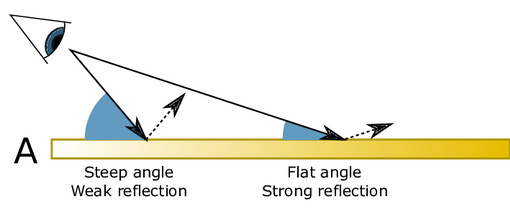

# Ocean Scene - OpenGL Project

## Theme

The theme of this project is the rendering of an ocean scene using the Sum of Sines method in a manner that is easy to implement and run in a video game context.

## Motivation

Water rendering is an important aspect of Real Time Rendering, being found in both the video game industry and the film industry. Although there are scientific methods for simulating water based on the Navier-Stokes equations, those methods are not feasible in a real-time context due to their complexity.

## Objectives

- Free-moving camera around the scene
- Water rendering using Sum of Sines
- Skybox implementation
- Water reflections using the skybox cubemap
- A complex animated model floating on water
- Ambient ocean audio

## Environment

- Visual Studio C++ 14
- GLSL version 400
- FreeGlut

## Libraries

| Library | Purpose |
|---|---|
| `stb_image` | Loading images used for textures |
| `objloader` | Loading the 3D model |
| `miniaudio` | Ambient ocean sound |

## Methodology

To more easily manage each object in the scene, an abstract base class called `Entity` was created and inherited by each object (water, skybox, model).

### Class Hierarchy

## Camera and Controls

The camera allows free movement in the scene using the WASD keys for movement and the mouse for rotation. Orientation is calculated from the yaw (left-right) and pitch (up-down) angles. Keys Q and E move the camera up and down, and ESC closes the program.

## Wave Generation

There are 2 popular methods for achieving this. The first is the Sum of Sines, which consists of modifying the Y coordinate of the water based on the result of the sum. The second method uses a frequency spectrum and the Fast Fourier Transform (FFT).

Due to the implementation complexity of the second method, the Sum of Sines was chosen for this project.

## Water

### Mesh Generation

The `generateWaterMesh()` function creates a horizontal plane on the XZ axis centered at the origin. `resolution` is the number of squares (per axis) and `squareSize` is the size of one square. The function iterates through the squares, calculates the x and z components for each square, and appends them to a float vector.

The uniforms sent to the shaders are: `time` for water animation, the skybox cubemap texture for reflections, the MVP matrix, and the light and camera positions.

### Vertex Shader

The vertex shader's purpose is to modify the Y component of the water plane to create the wave effect.

The `calculateWave` function handles this. It takes angle, wavelength, speed, and amplitude as parameters and returns a `vec3` containing the height and the partial derivatives on X and Z, which are used to recompute normals.

Instead of a simple sinusoid, the function `exp(sin(phase) - 1.0)` was chosen as it has a shape closer to that of real waves:

To obtain the final result, the fractional Brownian motion algorithm was applied. This algorithm involves applying scalings to the wave parameters during the sum calculation. Both the scaling parameters and the initial wave parameters were chosen empirically.

After computing the sum, the Y component is modified, normals are recalculated and passed to the fragment shader.

### Fragment Shader

The fragment shader implements Phong lighting with skybox reflections and a Fresnel component added on top.

The Fresnel effect represents the phenomenon where surfaces seen at shallow angles relative to the viewer reflect much more light than those seen at steep angles:

The specular component is multiplied by `(0.2 + 0.8 * fresnel)` to always have a minimum of 20% specular, increasing up to 100% at flat angles. The final color is a mix of `0.2 + fresnel` between the base lighting color and the reflection color.

## Skybox

The skybox is a cubemap with 6 textures representing the sky. It receives a `vector<string>` of image paths in its constructor. In the display function it uses only the view matrix (with translation removed) so it appears infinitely far away.

The vertex shader outputs `gl_Position = p.xyww`. After perspective division z/w gives 1.0 (the maximum depth), which makes the skybox render behind every other object. This is also why `glDepthFunc` must be set to `GL_LEQUAL` — without it the skybox would be rejected by the default `GL_LESS` depth test.

## Duck

The duck is the complex model of the scene. The model was obtained from free3d.com and contains position, normal, and UV texture coordinate data. Loading is handled by a modified `objloader` that also reads UV coordinates.

The duck is animated through 4 transformations applied to the model matrix:

1. **Y translation** — simulates floating on water using `sin(time)`
2. **Left-right rocking** — animated with `sin(time)` to simulate wave motion
3. **Front-back tilting** — also animated with `sin(time)`
4. **Continuous spin** — slow rotation around the Z axis

These animations do not follow the actual water height.

## Results

The result is a credible and performance-efficient ocean scene. The method does present visible limitations: viewed from above, the mesh tiling is noticeable, and choosing the wave parameters is a difficult empirical process.

## Conclusions

The Sum of Sines method is an accessible solution with acceptable results for real-time water rendering. Due to its limitations it is best suited for calm bodies of water of medium size, or scenes where the ocean does not play a central role.

In cases where higher fidelity is required, methods based on ocean spectra — such as the JONSWAP spectrum combined with the Fast Fourier Transform — produce more realistic and visually pleasing results with a high degree of parametrization, at the cost of greater implementation complexity.

## Potential Future Improvements

- Replace Sum of Sines with FFT-based wave simulation
- Duck animation follows actual water height
- Foam detection using the Jacobian operator accumulated into a texture
- Replace Phong lighting with Physically Based Rendering (PBR)
- Antialiasing
- Post-processing effects (HDR, bloom)

---

## References

### Theory
- https://learnopengl.com/Lighting/Basic-Lighting — Phong lighting
- https://learnopengl.com/Advanced-OpenGL/Cubemaps — skybox
- https://www.youtube.com/watch?v=PH9q0HNBjT4 — wave theory
- https://www.wikiwaves.org/index.php/Ocean-Wave_Spectra — ocean spectra

### Assets
- https://bumbadida.itch.io/skybox-textures-sdr — skybox textures
- https://free3d.com/3d-model/bird-v1--282209.html — duck model
- https://skyboxgen.com/ — skybox generator
- https://pixabay.com/sound-effects/nature-soothing-ocean-waves-372489/ — ocean sound
