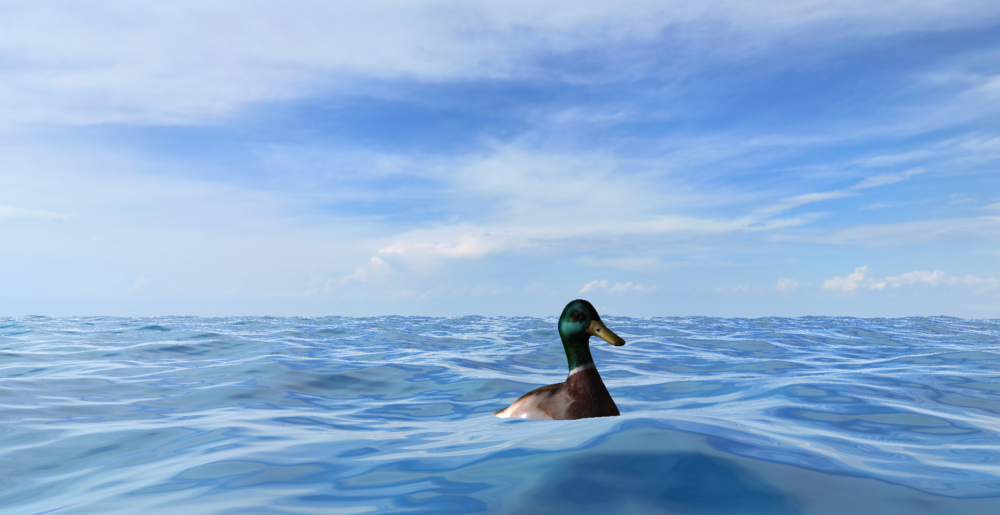

# Ocean Scene — OpenGL

Real-time ocean scene featuring animated water, skybox reflections, and an animated duck floating on the surface.

Built with `C++` · `OpenGL 4` · `GLSL 400` · `FreeGlut`

---

## Controls

| Key | Action |
|-----|--------|
| `W A S D` | Move |
| `Q` | Move up |
| `E` | Move down |
| `Mouse` | Look around |
| `ESC` | Quit |

---
## Documentation

Full technical documentation including methodology, shader explanation, class diagrams and references:

**[→ Read the Docs](Docs/README.mnd)**
